# Flex

## 一、Flex 布局是什么？

> Flex 是 Flexible Box 的缩写，意为"弹性布局"

```css
.box {
  display: flex;
}
// 行内元素也可以使用 Flex 布局。
.box2 {
  display: -webkit-flex; /* Safari */
  display: inline-flex;
}
```

## 二、基本概念

> 容器默认存在两根轴：水平的主轴（main axis）和垂直的交叉轴（cross axis）。

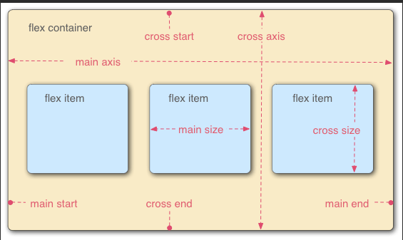

## 三、容器的属性

> flex-direction 属性决定主轴的方向

```css
.box {
  flex-direction: row | row-reverse | column | column-reverse;
}
```

- row(default): 主轴为水平方向，起点在左端。
- row-reverse: 主轴为水平方向，起点在右端。
- column: 主轴为垂直方向，起点在上沿。
- column-reverse: 主轴为垂直方向，起点在下沿。

> flex-wrap 属性如何换行

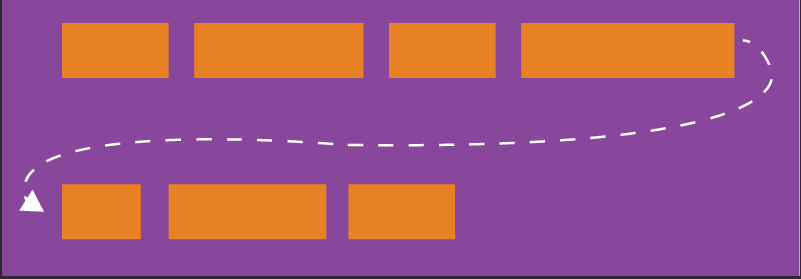

```css
.box{
  flex-wrap: nowrap | wrap | wrap-reverse;
}
```

- nowrap
- 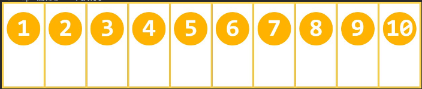
- wrap
- 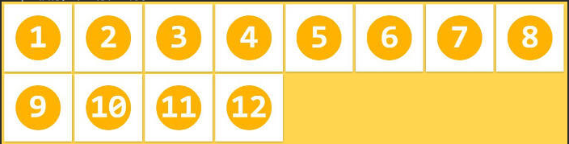
- wrap-reverse
- 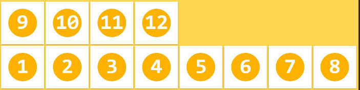

> flex-flow 是 flex-direction 属性和 flex-wrap 属性的简写形式，默认值为 row nowrap。

```css
.box {
  flex-flow: <flex-direction> || <flex-wrap>;
}
```

> justify-content 属性定义了项目在主轴上的对齐方式。

```css
.box {
  justify-content: flex-start | flex-end | center | space-between | space-around;
}
```

- 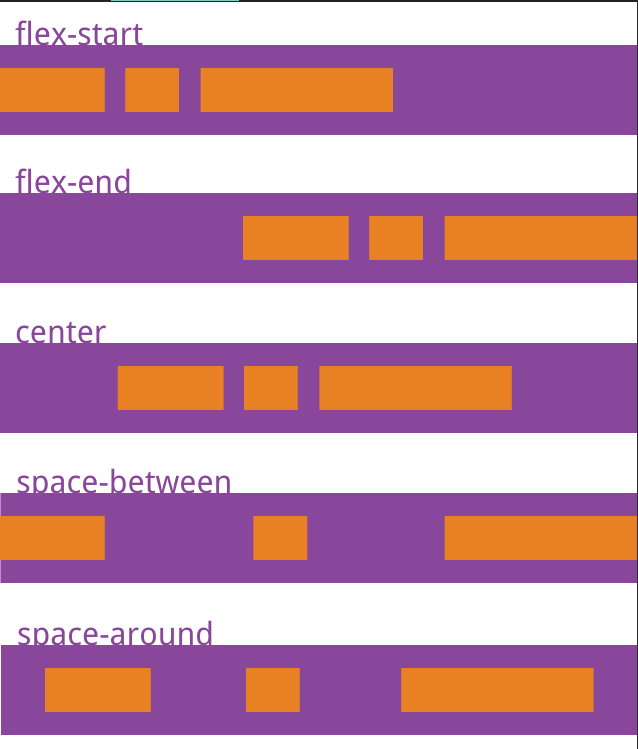

> align-items 属性定义项目在交叉轴上如何对齐。与 justify-content 相反的轴

```css
.box {
  align-items: flex-start | flex-end | center | stretch | baseline;
}
```

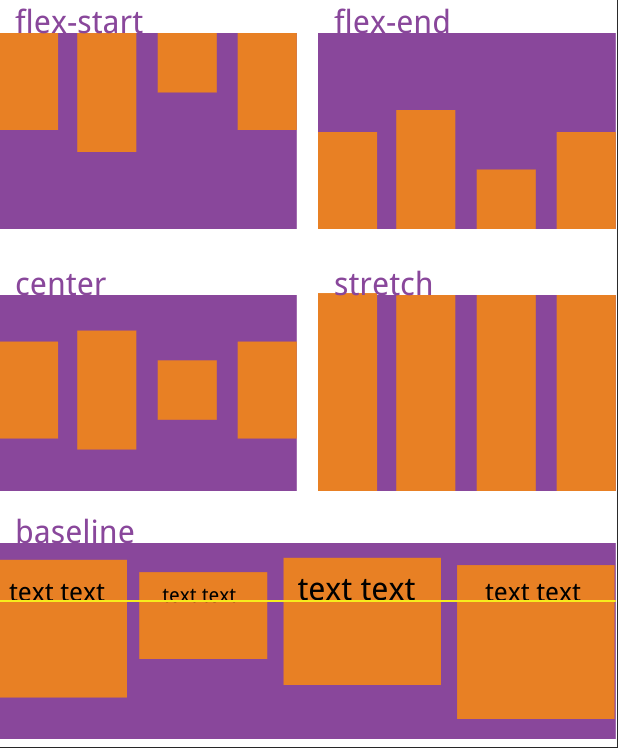

> align-content 属性定义了多根轴线的对齐方式。如果项目只有一根轴线，该属性不起作用。

```css
.box {
  align-content: flex-start | flex-end | center | space-around | space-between | stretch;
}
```

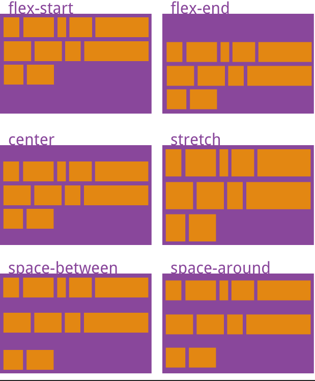

> order 属性定义项目的排列顺序。数值越小，排列越靠前，默认为0。

```css
.item {
  order: <integer>;
}
```

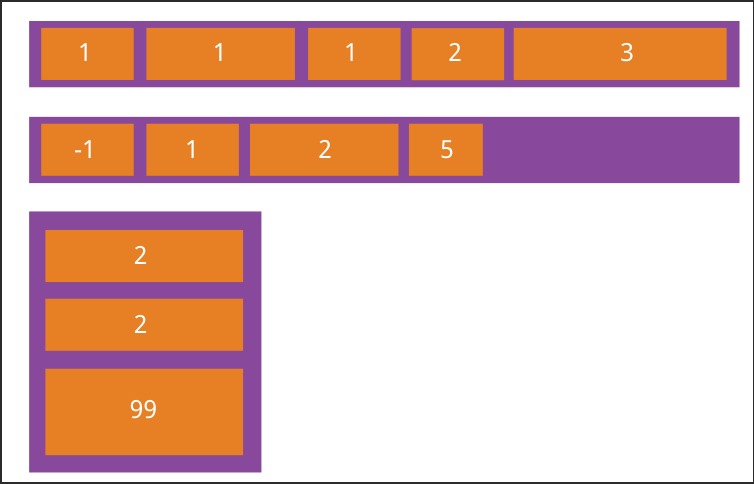

> flex-grow 属性定义项目的放大比例，默认为0，即如果存在剩余空间，也不放大。

```css
.item {
  flex-grow: <number>; /* default 0 */
}
```

- 如果所有项目的 flex-grow 属性都为1，则它们将等分剩余空间（如果有的话）
- 如果一个项目的 flex-grow 属性为2，其他项目都为1，则前者占据的剩余空间将比其他项多一倍

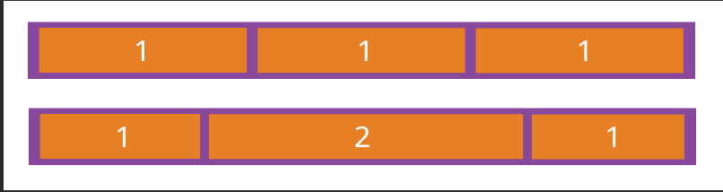

> flex-shrink 属性定义了项目的缩小比例，默认为1，即如果空间不足，该项目将缩小。

```css
.item {
  flex-shrink: <number>; /* default 1 */
}
```

- 如果所有项目的 flex-shrink 属性都为1，当空间不足时，都将等比例缩小。如果一个项目的flex-shrink属性为0，其他项目都为1，则空间不足时，前者不缩小。

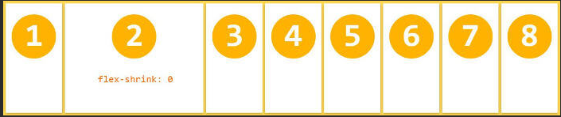

> flex-basis 属性定义了在分配多余空间之前，项目占据的主轴空间（main size）。浏览器根据这个属性，计算主轴是否有多余空间。它的默认值为 auto，即项目的本来大小。
> 它可以设为跟 width 或 height 属性一样的值（比如350px），则项目将占据固定空间。

```css
.item {
  flex-basis: <length> | auto; /* default auto */
}
```

> flex 属性是 flex-grow, flex-shrink, flex-basis 的简写，默认值为 0 1 auto。后两个属性可选。该属性有两个快捷值：auto (1 1 auto) 和 none (0 0 auto)。

```css
.item {
  flex: none | [ <'flex-grow'> <'flex-shrink'>? || <'flex-basis'> ]
}
```

> align-self 属性允许单个项目有与其他项目不一样的对齐方式，可覆盖 align-items 属性。默认值为 auto，表示继承父元素的 align-items 属性，如果没有父元素，则等同于 stretch
> 该属性可能取6个值，除了 auto，其他都与 align-items 属性完全一致

```css
.item {
  align-self: auto | flex-start | flex-end | center | baseline | stretch;
}
```

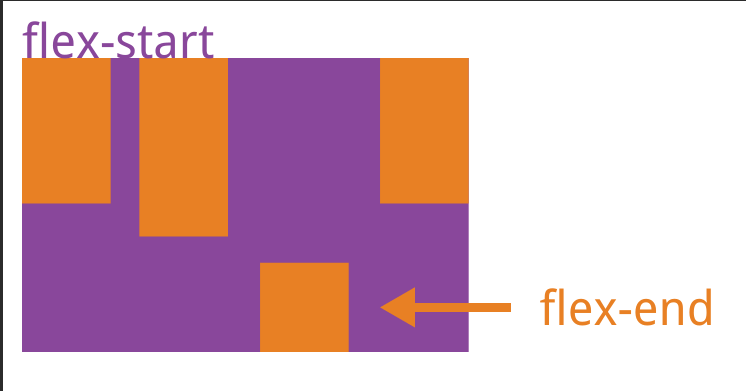

## 组合写法

- flex-flow: flex-direction || flex-wrap
- flex: flex-grow flex-shrink ? | flex-basis
- justify-content: flex-start | flex-end | center | space-between | space-around
- align-items:     flex-start | flex-end | center | stretch | baseline
- align-content:   flex-start | flex-end | center | space-between | space-around | stretch
